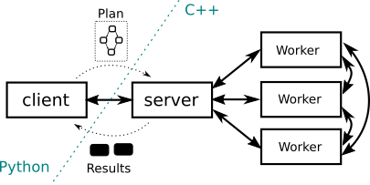

# HyperLoom

HyperLoom is a platform for defining and executing workflow pipelines in large-scale distributed environments.

HyperLoom implements its own schedulling algorithm optimized for execution of millions of interconnected tasks on hundreds of computational nodes. HyperLoom also includes a thin Python client module that allows to easily define and execute the pipelines on HyperLoom infrastructure.

HyperLoom features:

  * In-memory data processing reducing filesystem load.
  * Direct worker-to-worker data transfer reducing server overhead.
  * Support for execution of third party applications.
  * Data-location aware scheduling algorithm reducing inter-node network traffic.
  * C++ core with a Python client enabling high performance through a simple API.
  * High scalability and native HPC support.
  * BSD license.

For more information see the [full documentation](http://loom-it4i.readthedocs.io/en/latest/intro.html).

## Architecture


## Quickstart

Execute your first HyperLoom pipeline in 4 easy steps using [Docker](https://docs.docker.com/):

### 1. Deploy virtualized HyperLoom infrastructure

```bash
docker-compose up
```

Note that before re-running `docker-compose up` you need to run `docker-compose down` to delete containers state.

### 2. Install HyperLoom client (virtualenv)

```
virtualenv -p python3 loom_client_env
source loom_client_env/bin/activate
pip3 install -r python/requirements.txt
cd ./python
chmod +x generate.sh
./generate.sh
python3 setup.py install
```

### 3. Define a pipeline

Create a python file `pipeline.py` with the following content:

```python
from loom.client import Client, tasks

task1 = tasks.const("Hello ")        # Create a plain object
task2 = tasks.const("world!")        # Create a plain object
task3 = tasks.merge((task1, task2))  # Merge two data objects together

client = Client("localhost", 9010)   # Create a client object
future = client.submit_one(task3)    # Submit task

result = future.gather()             # Gather result
print(result)                        # Prints b"Hello world!"
```

### 4. Execute the pipeline

```bash
python3 pipeline.py
```

## Documentation

The compiled version of the documentation is available [here](http://loom-it4i.readthedocs.io/en/latest/intro.html).

You can also build the full documentation from the sources in the [doc](./doc) subdirectory by running `make html`.

## Citations

Please use the following BibTeX record when refering to HyperLoom in scientific publications.

```tex
@inproceedings{cima2018hyperloom,
  title={HyperLoom: A Platform for Defining and Executing Scientific Pipelines in Distributed Environments},
  author={Cima, Vojt{\v{e}}ch and B{\"o}hm, Stanislav and Martinovi{\v{c}}, Jan and Dvorsk{\`y}, Ji{\v{r}}{\'\i} and Janurov{\'a}, Kate{\v{r}}ina and Aa, Tom Vander and Ashby, Thomas J and Chupakhin, Vladimir},
  booktitle={Proceedings of the 9th Workshop and 7th Workshop on Parallel Programming and RunTime Management Techniques for Manycore Architectures and Design Tools and Architectures for Multicore Embedded Computing Platforms},
  pages={1--6},
  year={2018},
  organization={ACM}
}
```

## Benchmarks

HyperLoom scalability for a pharmaceutical machine-learning pipeline running on 1, 8, 16 and 64 nodes (24 CPUs each).

The picture below shows the execution times of different task types in the pipeline.


### Strong Scaling

Pipeline for strong scaling experiments contained ~460000 tasks in all of the cases.


### Weak Scaling

Pipeline for weak scaling experiments contained from ~12500 tasks (1 node) to ~800000 tasks (64 nodes).


## Acknowledgements

This project has received funding from the European Union’s Horizon 2020 Research and Innovation programme under Grant Agreement No. 671555. This work was also supported by The Ministry of Education, Youth and Sports from the National Programme of Sustainability (NPU II) project „IT4Innovations excellence in science - LQ1602“ and by the IT4Innovations infrastructure which is supported from the Large Infrastructures for Research, Experimental Development and Innovations project „IT4Innovations National Supercomputing Center – LM2015070“.

## License

See the [LICENSE](./LICENSE) file.
